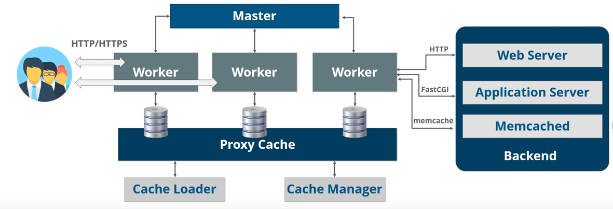

## What is a Web Server?

Web servers are computers which deliver the requested web pages. Every web server has an IP address and a Domain name.

If you want to make your computer to a web server then you have to install server software and connect the machine to the internet which is basically the global area network like XAMPP, Apache, Caddy, Nginx etc.



## Nginx Architecture

Nginx uses Master-slave architecture by supporting event-driven, asynchronous and non-blocking model.

When you have a process thread model what happens is each and every separate process basically can be used for an import or you know you can generate a seperate thread for each and every connection that is required. It can be very inefficient in term of memory and CPU consumption. As spawning the seperate processes or a thread basically requires preparation of a new runtime environment including allocation of heap and stack memory and also the creation of new exectuion contexts.

What happens for Nginx is, it doesn't spawn a process or the thread for every connection instead what happen is worker process acts of new requests from a shared listen socket and execute a highly efficient run loop and set each worker to process thousands of connection per worker.

## Nginx as a Web Server

```
http {
    server {
        listen 8080;
    }
}
```
